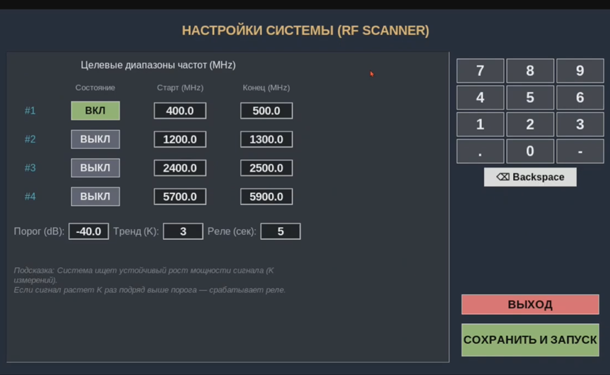

# RF Monitoring System

Real-time RF signal monitoring system built on **Raspberry Pi Zero 2W** and **HackRF One**.
Designed as a **commercial-grade embedded product prototype** with a fullscreen touchscreen GUI, GPIO-based hardware control, and real-time RF trend detection.

---

## Demo

[](https://youtu.be/70yDTlxS74c)

---

## Screenshots

### Main Interface


### Settings Screen



---

## Overview

This project is a standalone embedded RF monitoring platform that continuously scans selected frequency ranges, detects signal activity in real time, analyzes signal trends, and triggers external hardware output when defined conditions are met.

The system was developed as a practical product-oriented prototype combining:

* **RF scanning**
* **signal processing**
* **embedded control**
* **touchscreen GUI**
* **data logging**
* **hardware-level output control**

---

## Key Features

* 📡 Real-time RF frequency scanning via `hackrf_sweep`
* 📈 Signal trend analysis using **EWMA smoothing** and **consecutive rise detection**
* ⚡ GPIO relay control for external hardware triggering
* 🖥️ Fullscreen touchscreen GUI built with **Python / Tkinter**
* 📊 Session statistics and 5-day history logging with CSV
* 🔐 Hardware-based license protection using Raspberry Pi serial number lock
* 🔁 Auto-restart supervisor for crash recovery and continuous operation

---

## Hardware

| Component            | Role                                  |
| -------------------- | ------------------------------------- |
| Raspberry Pi Zero 2W | Main embedded controller              |
| HackRF One           | SDR receiver for RF scanning          |
| GPIO Pin 17          | Relay output (open-drain, active LOW) |
| Touchscreen display  | Fullscreen local interface            |

---

## System Architecture

```text
HackRF One
    │
    ▼
hackrf_sweep
    │
    ▼
Python parser
    │
    ▼
Signal tracker
    │
    ▼
EWMA smoothing
    │
    ▼
Consecutive rise detection
    │
    ├──► GPIO relay output
    │
    ├──► Tkinter GUI
    │
    └──► CSV history logging
```

---

## How It Works

1. The user defines scan ranges, detection threshold, trend sensitivity, and relay hold time from the settings screen.
2. The system continuously scans the selected RF ranges using **HackRF**.
3. Incoming sweep data is parsed and tracked in Python.
4. Signal power values are filtered using **EWMA smoothing** to reduce noise.
5. If a tracked signal rises above the threshold for **K consecutive updates**, the relay is triggered.
6. The relay remains active for the configured hold time, then resets automatically.
7. The GUI and CSV history are updated during operation.

---

## Signal Detection Logic

The detection pipeline is designed to reduce false triggering while remaining lightweight enough for embedded hardware.

### EWMA Smoothing

EWMA (**Exponentially Weighted Moving Average**) is used to smooth raw power readings and reduce short-term fluctuations.

This helps the system focus on meaningful signal trends instead of reacting to every noisy sample.

### Consecutive Rise Detection

Instead of triggering on a single spike, the system checks whether the signal shows **multiple consecutive increases** above the configured threshold.

This makes the detection logic more stable and more suitable for practical RF monitoring scenarios.

---

## Configuration

The settings screen allows the user to configure the following parameters:

| Parameter        | Description                                           |
| ---------------- | ----------------------------------------------------- |
| Frequency ranges | Up to 4 active scan ranges (MHz)                      |
| Threshold (dB)   | Minimum signal power to track                         |
| Trend K          | Number of consecutive rises required to trigger relay |
| Relay hold (sec) | How long the relay stays active after detection       |

---

## Project Structure

```text
rf-monitoring-system/
├── main.py
├── README.md
├── Main Interface.png
└── settings_screen.png
```

> In the current public version, screenshots are stored in the repository root.
> For a cleaner project layout, they can later be moved into a dedicated `docs/` folder.

---

## Installation

### Requirements

* Raspberry Pi Zero 2W
* HackRF One
* Raspberry Pi OS / Linux
* Python 3
* HackRF tools installed

### Setup

```bash
# Install Python dependency
pip install RPi.GPIO

# Install HackRF tools
sudo apt install hackrf

# Clone the repository
git clone https://github.com/ufukkirmizigedik/rf-monitoring-system
cd rf-monitoring-system

# Run the application
python main.py
```

---

## Licensing / Device Lock

> **Note:** Hardware license protection is disabled in this public version.

In the production build, the system checks the Raspberry Pi CPU serial number at startup and exits if the device is not authorized.

To enable this behavior, set `AUTHORIZED_SERIAL` in `main.py` to the target device serial number.

---

## Use Cases

This system can be adapted for scenarios such as:

* RF signal presence detection
* embedded monitoring systems
* event-triggered external control
* experimental RF surveillance setups
* standalone touchscreen-based field tools

---

## Tech Stack

* **Python 3** — core application logic
* **Tkinter** — fullscreen touchscreen GUI
* **HackRF / hackrf_sweep** — SDR-based RF scanning
* **RPi.GPIO** — relay output control
* **Threading** — non-blocking scan and supervisor flow
* **CSV** — local session and history logging

---

## Project Status

* ✅ Fully functional
* ✅ Tested on Raspberry Pi Zero 2W
* ✅ Developed as a commercial embedded prototype

---

## Author

**Ufuk Kırmızıgedik**
Automation Engineer | Embedded Systems | IoT | Computer Vision

* **Email:** [ufukkirmizigedik1984@gmail.com](mailto:ufukkirmizigedik1984@gmail.com)
* **Telegram:** [@K_Ufuk](https://t.me/K_Ufuk)
